# Experiment network structures

This document diagrams every experiment network structure implemented by the
experiments project. Dimensions are the defaults in the experiment entry
points. `C` means class count, `T` means simulation timesteps, and `P` means
readout population per class.

## Experiment map

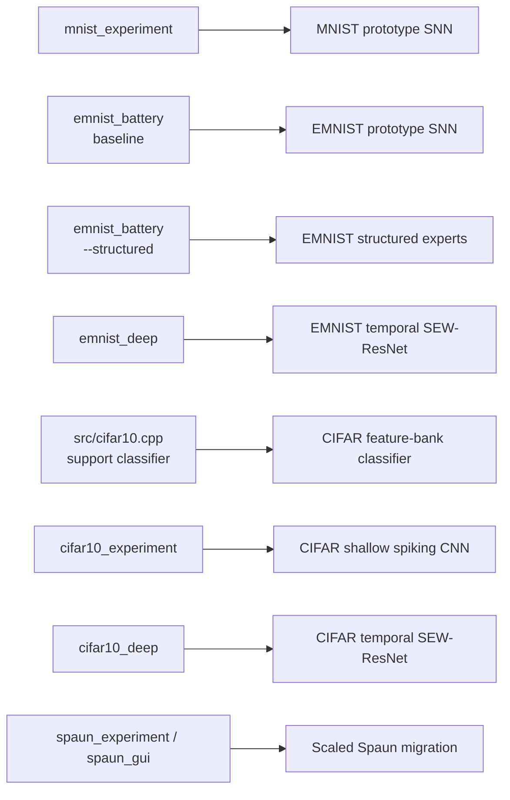

The classifier in `src/cifar10.cpp` is included because it is a complete
experiment-support implementation, although the current `cifar10_experiment`
entry point instantiates `snnbase::spiking_conv::Classifier` instead.

## Shared spiking building blocks

### Prototype neuron

The MNIST and non-deep EMNIST models use a bank of `snnbase::Neuron` objects.
Each neuron stores bounded spike-event prototypes and scores a new event by
similarity to its stored history. Reinforcement, novelty admission, replay,
and STDP relevance update that history.

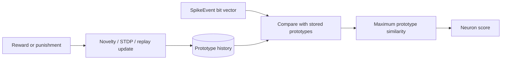

### Temporal spiking convolution

The deep EMNIST and deep CIFAR models use the same temporal convolution unit.
The convolution computes synaptic current; batch normalization conditions that
current; and a learnable leaky integrate-and-fire neuron produces spikes at
every timestep. Therefore these convolution stages are spiking layers, not
ordinary ANN convolution blocks.

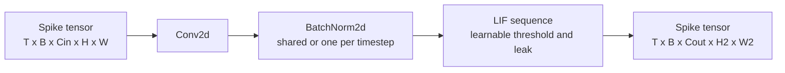

### SEW residual block

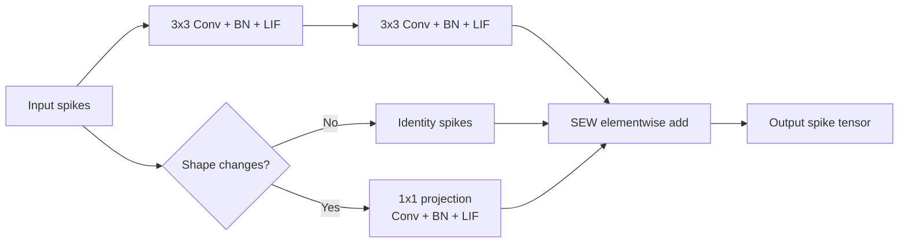

The SEW addition is performed independently at each timestep. Coincident
spikes can produce a value of two; the result is intentionally not clipped
before entering the next spiking convolution.

### Native Spaun visual front end

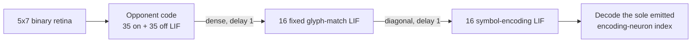

The caller supplies a retina rather than a symbol label. Host code detects a
new presentation and decodes an emitted index, but all matching occurs in the
two explicit spiking projections. Retina-to-visual and visual-to-encoding are
independent causal lesion points.

### Recurrent semantic workspace

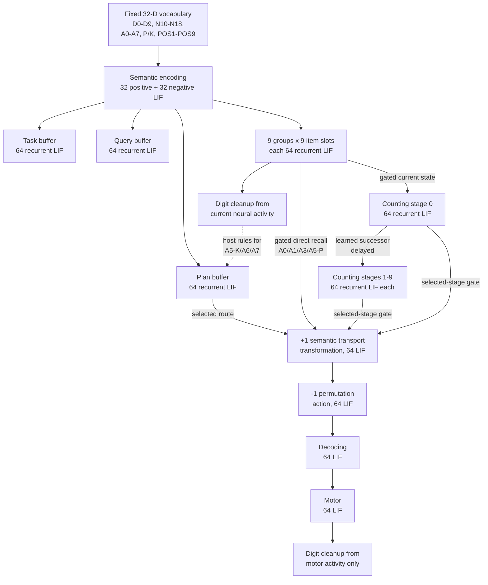

Every represented dimension uses an opponent pair; the default has one neuron
per sign. Separate recurrent gains for the first, middle, and final list slots,
plus seeded slot noise, provide a mechanism for primacy and recency. They have
not yet been shown to reproduce Spaun's published serial-position curves.

The solid selected-route edges are gated spiking projections. Host control
chooses which gate to open, but A0/A1/A3 and A5 position responses are not
decoded and rebuilt as host plans. A5 kind queries, A6, and A7 still use the
dotted host transform before their planned digits enter the output pipeline.

### Delayed spiking counting chain

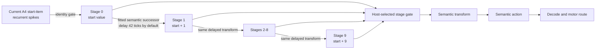

The successor matrix is fitted from semantic-pointer pairs `0 -> 1` through
`17 -> 18`. A4 seeds stage zero from the existing working-memory spike, clocks
one delayed projection per requested increment, and routes the selected stage
through the normal spiking output path. At a 10 ms tick, the default 42-tick
delay contributes 420 ms per item. Host code still supplies the increment
count, clocks and selects the stage, and formats values 10--18 as two decimal
digits; it does not compute the sum itself.

### Reward-modulated action selector

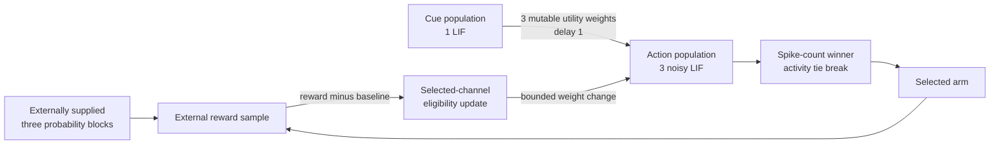

This compact selector uses the native population runtime's
`reward_modulated_hebbian` projection. It replaces the scaffold's host utility
array. The environment owns the supplied contingency and reward sample; the
spiking selector owns choice and utility adaptation. One model call still
orchestrates the 60 choice/reward exchanges and reads the final utility winner,
and this is not an anatomical reproduction of Spaun's basal ganglia and
thalamus.

## 1. MNIST prototype SNN

Entry point: `experiments/mnist/main.cpp`

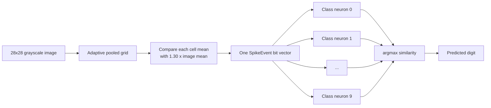

Structure:

- One event encoder compresses the image into at most the available spike-event
  payload bits.
- There are exactly ten independent prototype neurons, one per digit.
- Supervised training reinforces only the neuron associated with the label.
- Prediction evaluates all ten neurons and selects the largest similarity.
- This is an event/prototype SNN; it has no convolution or dense ANN layer.

## 2. EMNIST baseline prototype SNN

Entry point: `experiments/emnist/main.cpp` without `--structured`

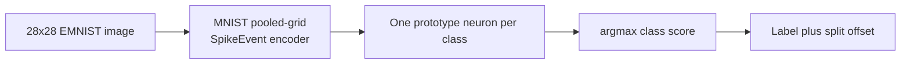

The structure is the MNIST prototype network generalized to the selected
split. `C` is 10 for digits/mnist, 26 for letters, 47 for balanced/bymerge,
or 62 for byclass. The letters split adds label offset one after classification.

## 3. EMNIST structured expert SNN

Entry point: `experiments/emnist/main.cpp --structured`

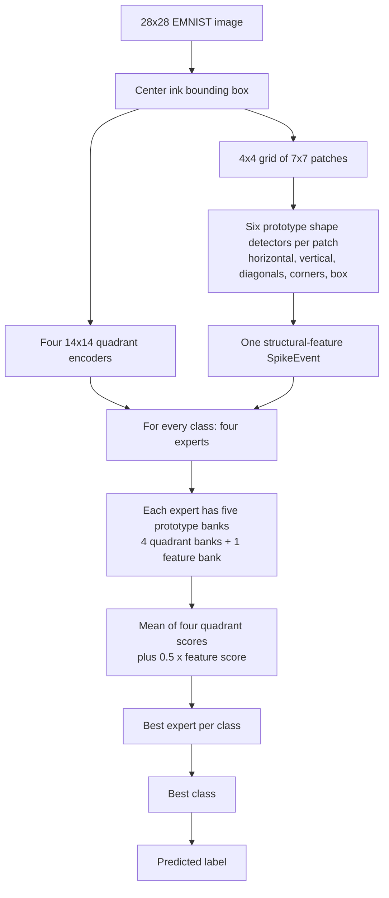

Per selected class, the network contains:

- four experts;
- five `snnbase::Neuron` prototype banks per expert;
- up to 64 prototypes per bank;
- four quadrant event channels plus one learned structural-feature channel.

The patch feature layer contains six fixed prototype detectors. Training uses
small deterministic image shifts, assigns examples to available/best experts,
reinforces a misclassified correct expert, and punishes the competing expert.

## 4. EMNIST deep temporal SEW-ResNet

Entry point: `experiments/emnist/deep_main.cpp`

Default: `T=4`, `P=2`, two residual blocks per stage.

```mermaid
flowchart LR
  I[1x28x28 normalized image] --> R[Repeat direct current<br/>across T=4 steps]
  R --> ST[Stem<br/>3x3, 1 to 16<br/>BN + LIF]
  ST --> S1[Stage 1<br/>2 SEW blocks<br/>16x28x28]
  S1 --> S2[Stage 2<br/>2 SEW blocks<br/>32x14x14<br/>first block stride 2]
  S2 --> S3[Stage 3<br/>2 SEW blocks<br/>64x7x7<br/>first block stride 2]
  S3 --> GAP[Spatial global average<br/>at every timestep]
  GAP --> FC[Linear 64 to C x 2]
  FC --> PM[Mean population dimension]
  PM --> TM[Leaky temporal membrane readout]
  TM --> O[C class logits]
```

Every stem and residual convolution is followed by an LIF spike generator.
Only the final linear population readout and leaky logit accumulator are
non-spiking arithmetic. The number of output classes and label offset come
from the selected EMNIST split.

## 5. CIFAR-10 handcrafted feature-bank classifier

Implementation: `src/cifar10.cpp`

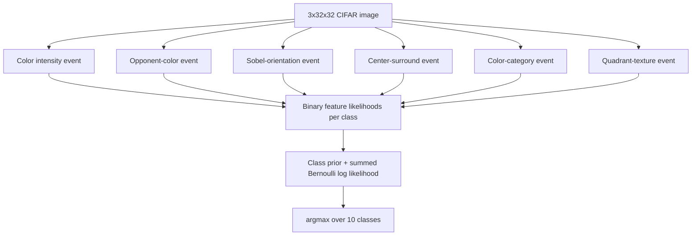

This classifier creates six spike-event feature banks and learns per-class
active-bit counts. Its decision rule is a smoothed Bernoulli naive-Bayes score.
It operates on spike-event features but does not contain simulated LIF layers;
it is best understood as an event-coded statistical baseline.

## 6. CIFAR-10 shallow spiking convolution network

Entry point: `experiments/cifar10/main.cpp`

Default: 16 channels, `T=8`, threshold 0.5, channel normalization enabled,
and SEW-add residual merge.

```mermaid
flowchart LR
  I[3x32x32 image] --> RC[Rate representation<br/>T=8 discrete levels]
  RC --> C1[Conv 3x3 same<br/>3 to 16]
  C1 --> N1[Per-channel normalization]
  N1 --> L1[Spiking neurons<br/>16x32x32]
  L1 --> C2[Conv 3x3 same<br/>16 to 16]
  C2 --> N2[Per-channel normalization]
  N2 --> L2[Spiking neurons<br/>16x32x32]
  L1 --> ADD[SEW-add skip]
  L2 --> ADD
  ADD --> FLAT[Flatten 16x32x32]
  FLAT --> D[Dense to 10 class units]
  D --> SM[Softmax probabilities]
  SM --> O[Predicted class]
```

Both convolution layers use `snnbase::Neuron` thresholded spike/rate units.
The residual mode is configurable as none, averaged add, SEW add, or SEW
multiply. Unlike the deep temporal model, this implementation explicitly
stores scalar convolution weights and manually computes surrogate gradients
and Adam updates.

## 7. CIFAR-10 deep temporal SEW-ResNet

Entry point: `experiments/cifar10/deep_main.cpp`

Default: width 32, two blocks per stage, `T=4`, `P=2`. The selected sweep
configuration changes width to 48 but leaves the topology unchanged.

```mermaid
flowchart LR
  I[3x32x32 normalized image] --> AUG[Random crop / flip<br/>optional Cutout]
  AUG --> ENC[Direct-current repeat<br/>T=4 spike simulation steps]
  ENC --> ST[Stem<br/>3x3, 3 to W<br/>BN + LIF]
  ST --> S1[Stage 1<br/>2 SEW blocks<br/>W x 32x32]
  S1 --> S2[Stage 2<br/>2 SEW blocks<br/>2W x 16x16<br/>stride-2 projection]
  S2 --> S3[Stage 3<br/>2 SEW blocks<br/>4W x 8x8<br/>stride-2 projection]
  S3 --> GAP[Spatial global average<br/>per timestep]
  GAP --> FC[Linear 4W to 10 x P]
  FC --> POP[Population mean<br/>P=2]
  POP --> MEM[Leaky temporal membrane accumulation]
  MEM --> O[10 class logits]
```

For the default `W=32`, the stage widths are 32, 64, and 128. For the
accuracy-sweep `W=48` model, they are 48, 96, and 192. Each downsampling block
uses a spiking 1x1 projection on the skip branch. Batch normalization can be
shared across time or replaced with independent per-timestep BNTT statistics.

### Complete deep-model dataflow

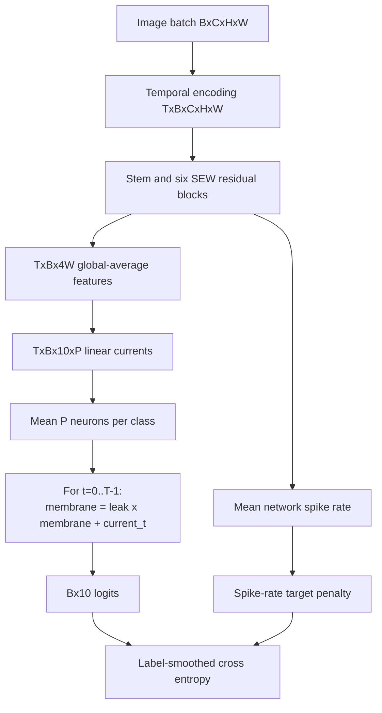

The classifier intentionally reads membrane/current values rather than forcing
the ten output units to spike. This preserves gradient information at the
decision boundary while all spatial feature extraction remains on the spiking
substrate.

## 8. Scaled Spaun perception-cognition-action migration

Entry points: `experiments/spaun/main.cpp` and
`experiments/spaun/gui_main.cpp`

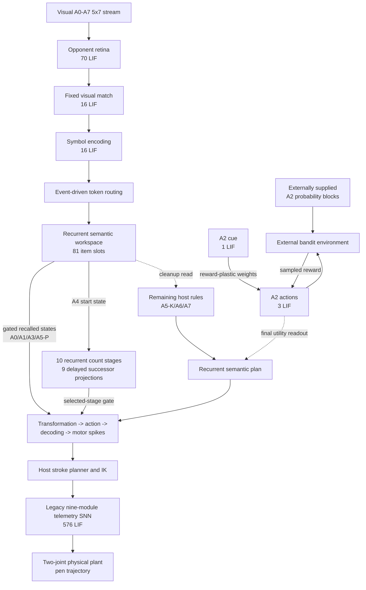

`spaun_experiment` reports **7,018 LIF neurons and 1,489,322 stored
coefficients** at the current defaults: 102/1,136 visual, 6,336/1,486,848
semantic, 4/3 selector, and 576/1,335 legacy telemetry.
Do not reuse the old 576-neuron/1,335-synapse baseline as a current total: it
describes only the legacy graph and predates the semantic and counting
populations.

Task cues and operands are recovered from retina-driven spikes and retained in
recurrent semantic populations. A0/A1/A3 and A5 position-query digits traverse
explicit selected-slot gates without being rebuilt as host plans. A4 advances
the recalled start state through a delayed, fitted semantic-successor chain.
A2 contingencies come from the external environment while choice utilities
adapt in reward-plastic synapses.

Host orchestration remains decisive: it parses recognized tokens, selects
recall gates, clocks and selects the A4 stage, formats multi-digit values,
reads the final A2 utility winner, and computes A5 kind-query, A6, and A7 plans.
The GUI is observational and does not feed its decoded telemetry back into the
model. Behavioral scoring requires a decoded match plus observable arm ink,
but does not yet perform blinded handwriting recognition. The component
circuits also advance on separate clocks bridged by host calls; GUI time comes
from the legacy graph. The architecture therefore remains a scaled migration,
not end-to-end Spaun-equivalent neural cognition.

The separate A1 benchmark uses a 28×28 two-convolution spiking classifier
(12-channel 5×5/stride-2, then 24-channel 3×3/stride-2, eight timesteps). Its
registered held-out MNIST result is 9,835/10,000, or 98.35%. It is benchmark
evidence for A1, not the visual front end currently wired into this diagram.
See [the Spaun architecture narrative](SPAUN_EXPERIMENT.md) and
[the behavioral benchmark record](results/SPAUN_BEHAVIORAL_BENCHMARK.md) for
evidence limitations.

## Structural comparison

| Structure | Spatial feature extraction | Temporal simulation | Learned representation | Classifier |
|---|---|---:|---|---|
| MNIST prototype | Pooled event grid | No | Per-class spike prototypes | Maximum similarity |
| EMNIST baseline | Pooled event grid | No | Per-class spike prototypes | Maximum similarity |
| EMNIST structured | Quadrants + patch detectors | No | Class/expert prototype banks | Best expert then class |
| EMNIST deep | Spiking SEW-ResNet | 4 steps | Surrogate-trained LIF features | Population membrane readout |
| CIFAR feature bank | Six handcrafted event banks | No | Per-class bit frequencies | Bernoulli log likelihood |
| CIFAR shallow | Two spiking convolutions | 8 levels/steps | Surrogate-trained spike rates | Dense softmax |
| CIFAR deep | Spiking SEW-ResNet | 4 steps | Surrogate-trained LIF features | Population membrane readout |
| Scaled Spaun | Native 5×7 opponent retina; separate 28×28 A1 benchmark | Host-coupled 10 ms component clocks; delayed counting; 8-step A1 classifier | Recurrent semantic LIF slots + successor stages + reward-plastic selector; host control and A5-K/A6/A7 rules remain | Motor semantic cleanup then two-joint arm trajectory |
