# Scaled Spaun experiment on snnbase

## Purpose and fidelity statement

This experiment is a scaled Spaun migration built on `snnbase`; it does not
import Nengo, the Neural Engineering Framework (NEF), or the Semantic Pointer
Architecture (SPA) implementation. One model accepts visual `A0` through `A7`
instruction streams and produces its reported responses through a simulated
two-joint arm.

It is **not a scientific reproduction of the original Spaun yet**. The current
model has a native spike-causal visual front end, recurrent opponent-coded
semantic working memory, explicit semantic output routing, a delayed spiking
semantic-successor chain, and a reward-modulated spiking action selector.
A0, A1, and A3 responses route recalled recurrent states directly; A5 position
queries gate the requested recurrent slot directly; A4 advances a recurrent
state through the delayed successor chain; and A2 learns its choice utilities
from externally supplied reward contingencies.

Those changes remove the old blanket description of A0/A1/A3--A7 as
host-computed answers, but they do not make the model autonomous. Host code
still parses the recognized stream, selects and clocks gates, implements A5
kind (`K`) queries and the A6/A7 rules, formats multi-digit counting results,
reads out the final A2 utility winner, and performs stroke planning and inverse
kinematics. The canonical eight-task run is therefore an implementation smoke
test, not evidence of behavioral equivalence. The original model contained
approximately 2.5 million spiking neurons and was evaluated against behavioral
distributions rather than eight fixed answers.

Primary references:

- [Eliasmith et al., “A Large-Scale Model of the Functioning Brain,” Science
  338, 2012](https://compneuro.uwaterloo.ca/files/publications/eliasmith.2012.pdf)
- [Original Spaun supplemental
  material](https://cs.uwaterloo.ca/~jhoey/teaching/cogsci600/papers/Spaun_Supplemental_Material_manualcitations.pdf)
- [Computational Neuroscience Research Group publication
  record](https://compneuro.uwaterloo.ca/publications/eliasmith2012.html)
- [Stewart and Choo, “Spaun: A Perception-Cognition-Action Model Using Spiking
  Neurons,” 2012](https://compneuro.uwaterloo.ca/files/publications/stewart.2012c.pdf)
- [Stewart and Eliasmith, “Large-Scale Synthesis of Functional Spiking Neural
  Circuits,” 2014](https://compneuro.uwaterloo.ca/files/publications/stewart.2014.pdf)
- [Official Spaun 2.0 source](https://github.com/xchoo/spaun2.0)
- [Official Spaun videos and descriptions](https://xchoo.github.io/spaun2.0/videos.html)

## Source model being targeted

The 2012 Science model used the same unmodified network for eight tasks. It was
shown only sequences of 28×28 character images; every symbol was visible for
150 ms followed by a 150 ms blank. `A` and a digit selected the task. Its only
behavioral output was movement of a physically modeled two-degree-of-freedom
arm.

The functional architecture contained three compression/decompression
hierarchies—vision, working memory, and motor—plus action selection and five
shared subsystems: information encoding, transformation calculation, reward
evaluation, information decoding, and motor processing. A basal-ganglia/
thalamus circuit selected actions and changed routing between those shared
subsystems.

## snnbase architecture

```mermaid
flowchart LR
  RET[5x7 opponent-coded retina<br/>70 LIF] --> VIS[Visual match<br/>16 LIF]
  VIS --> ENC[Symbol encoding<br/>16 LIF]
  ENC --> TOK[Token-event router]
  TOK --> SEM[Semantic encoding<br/>64 LIF]
  SEM --> WM[81 recurrent item slots<br/>plus task/query/plan buffers]
  WM --> DG[Selected recalled-state gate<br/>A0/A1/A3/A5-P]
  DG --> TX[Semantic transport transform]
  WM -->|A4 start-slot gate| C0[Recurrent count stage 0]
  C0 -->|learned successor<br/>42-tick default delay| C1[Count stage 1]
  C1 -->|successor stages| C9[Count stage 9]
  C0 --> CG[Selected count-stage gate]
  C1 --> CG
  C9 --> CG
  CG --> TX
  CTRL[Host task controller] -. selects direct route .-> DG
  CTRL -. clocks and selects count stage .-> CG
  WM --> READ[Neural activity cleanup]
  READ -. remaining host rules<br/>A5-K/A6/A7 .-> SOLVE[Task-specific transform]
  SOLVE --> PLAN[Recurrent semantic plan]
  PLAN --> TX
  TX --> ACT[Semantic action]
  ACT --> DEC[Semantic decoding]
  DEC --> MOT[Motor semantic population]
  MOT -. decoded digit .-> STROKE[Host stroke planner and IK]
  STROKE --> ARM[Legacy motor/arm telemetry SNN]
  ARM --> PLANT[2-joint physical plant]

  BLOCKS[Externally supplied A2<br/>probability blocks] --> REWARD[Host bandit environment]
  CUE[Bandit cue<br/>1 LIF] -->|reward-plastic utility weights| BANDIT[3 action LIF]
  BANDIT --> REWARD
  REWARD -->|reward / prediction error| BANDIT
  BANDIT -. final learned-utility readout .-> PLAN
```



The implementation currently combines four circuits:

| Circuit | Default structure | Neurons | Stored coefficients | Role |
|---|---|---:|---:|---|
| Native visual front end | 70 retinal + 16 visual + 16 encoding LIF | 102 | 1,136 | Converts a retina, not a symbol label, into an encoding spike |
| Native semantic workspace | 99 populations: shared buffers/output, 9×9 recurrent item slots, and 10 recurrent counting stages; 64 LIF each | 6,336 | 1,486,848 | Recurrent state, gated recall, delayed successor counting, and semantic output routing |
| Native reward selector | 1 cue + 3 action LIF | 4 | 3 | A2 choice and reward-modulated utility learning |
| Legacy functional/GUI graph | 9 populations × 64 LIF | 576 | 1,335 | Module activity, raster telemetry, motor/arm drive |
| **Total** | Four host-coupled spiking circuits | **7,018** | **1,489,322** | Runtime total reported by `spaun_experiment` |

`spaun_experiment` reports the instantiated neuron and stored-coefficient totals
at runtime, including the visual, semantic, selector, and legacy circuits.
Static totals from the superseded baseline predate both the workspace and the
counting stages and must not be reused as current architecture counts.

The dotted edges in the diagram identify the remaining cognitive boundaries.
Visual recognition, semantic retention, direct digit recall, the A4 successor
operation, and A2 utility adaptation have causal spiking paths. Every recalled,
counted, or planned output also traverses the
transformation/action/decoding/motor projections. Host control still decides
which route to open and when, and `Model::solve()` still supplies plans for A5
kind queries, A6, and A7. The legacy nine-population graph is phase-driven
telemetry; it must not be mistaken for the causal implementation of those
algorithms.

### Visual input and routing

The current visual vocabulary contains digits `0`–`9` and task symbols `A`,
`P`, `K`, `[`, `]`, and `?`. `VisualFrontend` rasterizes canonical 5×7 patterns
into 35 positive/negative retinal channels (70 LIF neurons). A delayed dense
projection drives 16 fixed match neurons and a delayed diagonal projection
drives 16 encoding neurons. Recognition is decoded only from an emitted
encoding spike; host code does not compare the input retina with a prototype.
Both projections can be lesioned independently and clear queued drive.

The task identifier and operands are parsed from this recognized stream;
`Trial.groups`, `Trial.query_kind`, and `Trial.query_value` are left empty by the
behavioral runner. The fixed 5×7 matcher is still much simpler than Spaun's
learned 28×28 hierarchy. A separate registered 28×28 A1 spiking-convolution
benchmark reached **98.35% (9,835/10,000)** on the held-out official MNIST test
set. That result exceeds Spaun's reported 94% A1 value, but this trained
classifier can now be loaded into the integrated task model for digit stimuli
with `spaun_experiment --learned-digit-checkpoint PATH`. The model rasterizes
the visible 5×7 digit to 28×28 and routes the learned classifier's output into
the semantic workspace; A, brackets, P, and K remain on the native visual
route. This is a checkpoint-level integration, not yet a shared latent-spike
interface or a handwriting-in-the-loop behavioral result.

### Working memory

`snnbase::semantic_pointer` supplies a fixed deterministic 32-dimensional
vocabulary for digits `D0`--`D9`, numeric states `N10`--`N18`, A0--A7, P/K,
and positions 1--9.
`snnbase::semantic_population` represents every dimension with positive and
negative LIF channels. The workspace contains explicit recurrent populations
for 81 group/item slots, task state, query state, the output plan, and ten
counting stages. It can store at least nine groups of nine items, and
recall/cleanup reads only current neural activity.

At the integrated model's default settings, memory slots have seeded noise and
different recurrent gains for initial, middle, and final positions. This is a
mechanism for primacy/recency effects, not evidence that the published serial-
position curves have been reproduced. Lesioning encoding-to-memory or memory
recurrence removes recall; lesioning any downstream semantic projection removes
motor decoding.

The original Spaun represented a list as a superposition of position/item
bindings, approximately

```text
memory = sum(position_i bound_with item_i),
```

using high-dimensional distributed vectors and recurrent dynamics. `snnbase`
now provides native circular-convolution binding/unbinding primitives, but the
integrated experiment uses one recurrent population per item rather than a
single bound superposition. A0/A1/A3 and A5 position queries therefore use
selected-slot gates rather than bound-memory unbinding. Neural rule execution
for A5 kind queries, A6, and A7 remains unresolved.

### Direct output gates and delayed counting

For A0, A1, and A3, `Model::run()` opens a gated projection from each requested
recurrent item slot directly to the semantic transformation population. It
does not decode the digit into a new host-created plan. An A5 position query
uses the decoded position to choose a slot, then sends that slot's current
spiking state through the same route. Gate selection is still host control, so
these paths are causal spiking recall without being a neural task controller.

A4 starts by gating the current first-item memory state into counting stage
zero. Ten recurrent counting populations are connected by nine delayed
feed-forward projections. Their semantic successor transform is fitted from
the 18 pairs `0 -> 1` through `17 -> 18`; each elapsed stage therefore advances
the represented number once. The default delay is 42 simulation ticks, or
420 ms at the default 10 ms tick. After the requested number of increments,
the selected stage traverses the same transformation, action, decoding, and
motor route as every other response.

The host does not add the two A4 operands, but it still reads the increment
count, clocks the required stages, selects the result stage, and converts an
`N10`--`N18` result into decimal output digits. This is a delayed spiking
successor mechanism, not yet Spaun's neurally selected counting policy.

### Action selection and reinforcement

`snnbase::action::RewardModulatedSelector` implements A2 with a one-neuron cue
population, three noisy LIF action channels, and a dense reward-modulated
projection. Spike counts are the primary action readout; filtered activity and
a seeded tie break resolve ties. Reward prediction error updates the selected
channel through an eligibility trace and bounded mutable utility weight.

The benchmark runner supplies all three 20-trial probability blocks through
`Trial::reward_probability_blocks`; the default blocks use 0.72 for the best
arm and 0.12 for the others, with the best arm changing after trials 20 and 40.
The host environment samples each externally specified contingency, while the
selector chooses and updates its utility projection from the resulting reward.
That environment boundary is legitimate, but one `Model::run()` call still
orchestrates all 60 choice/reward exchanges and host code reads the final
learned utility winner. The selector is basal-ganglia-like, not a reproduced
striatal/STN/GPe/GPi/thalamic circuit. The source publishes a trajectory and
five-trial moving-choice curve, not a numeric A2 pass threshold.

### Motor system

Only a digit decoded from the workspace's motor population is admitted to the
drawing stage. Host code then converts that digit to pen targets and drives the
legacy motor/arm telemetry populations. A classical plant integrates shoulder
and elbow angles, angular velocities, stiffness, and damping. Forward
kinematics generate the end-effector position and pen trace shown in the GUI.
Host-side plant physics is consistent with the original neural-controller/
environment boundary; host-side digit stroke planning and inverse kinematics
are reduced-fidelity motor components.

The motor decoder uses ordered vector strokes for all ten decimal digits. The
arm first converges on each stroke's initial point with the pen raised, follows
interpolated targets with the pen lowered, and preserves every pen-lift boundary
in the probe trace. For multi-digit responses, each digit is drawn full-size in
the center, held for 350 ms, and erased before the next digit begins. The final
digit remains visible when playback finishes. Explicit `digit display` and
`surface erase` probe phases make the sequence reproducible when paused or
single-stepped. This avoids treating visual bitmap scan lines as a handwriting
trajectory and ensures the displayed ink is the physical arm's measured
end-effector path rather than an ideal target overlay.

For a nonempty expected response, trial-level behavioral correctness requires
both the expected decoded answer and a nonempty physical pen trace. Thus a
motor-to-arm lesion can leave the cognitive answer available for diagnostics
while correctly failing the observable behavior.

## Behavioral evidence status

The benchmark code deliberately keeps four concepts separate:

1. a published numeric reference, such as Spaun's reported A1 accuracy;
2. a published protocol parameter, such as 40 A3 runs per list length;
3. a published qualitative claim, such as an A3 primacy/recency profile; and
4. a project-defined acceptance gate used to decide whether this implementation
   is close enough.

The source paper does **not** define a universal 95% accuracy target for A0--A7.
The project's A1 gate is at least 94% because that matches the published Spaun
result. The registered snnbase A1 run passed that local gate with 98.35%. A
consolidated seed-42 report also completed A2--A5: all five A1--A5 gates passed,
none failed, and A0/A6/A7 remained missing. The A3/A5 defaults were confirmed
on seeds 42--44 and intentionally favor the published primacy/recency shapes
over ceiling exact recall. Until one durable report satisfies all task-specific
gates and the causal ablation requirement, it must report
`behavioral_equivalence_supported=false`,
`spiking_mechanism_supported=false`, and
`full_equivalence_supported=false`.

See [the behavioral benchmark record](results/SPAUN_BEHAVIORAL_BENCHMARK.md)
for the task-by-task published targets, the exact A1 result, provenance rules,
and unresolved causal and behavioral gaps.

## Task battery

| Task | Canonical visual stream | Behavioral contract |
|---|---|---|
| A0 Copy drawing | `A0[2]?` | Reproduce the visible digit |
| A1 Recognition | `A1[7]?` | Produce the cleaned-up digit class |
| A2 Reinforcement learning | `A2?` plus reward stream | Track a switching three-arm bandit |
| A3 Serial working memory | `A3[015873]?` | Recall the complete ordered list |
| A4 Counting | `A4[3][5]?` | Count five from three and write eight |
| A5 Question answering | `A5[015873][P][2]?` | Return item at position two; `K` queries are also tested |
| A6 Rapid variable creation | `A6[0014][14][0094][94][0074]?` | Infer removal of the shared prefix and return `74` |
| A7 Fluid reasoning | `A7[1][11][111][4][44][444][5][55]?` | Complete the progression with `555` |

The same configured `Model` instance and circuit composition execute every
task. `run()` resets transient neural/arm state between canonical trials but
does not rebuild or reconnect the circuits.

## Native GUI

`spaun_gui` is a FreeGLUT/OpenGL application. It consumes immutable probe frames
after simulation; decoded GUI values never feed back into the model.

The window contains:

- the current upscaled retinal symbol and visual cleanup result;
- a stylized anatomical map colored blue-to-red by module activity;
- rate bars and exact spike counts for all nine populations;
- a rolling 90-tick spike raster;
- working-memory contents, selected route, reward, and decoded response;
- a top-down two-joint arm, pen state, and drawing trace.

Controls:

| Key | Action |
|---|---|
| `0`–`7` | Select A0–A7 |
| Space | Pause/resume |
| `n` | Single step |
| `d` | Jump directly to motor drawing |
| `r` | Restart current trace |
| `+` / `-` | Change playback speed |
| `q` or Escape | Exit |

The GUI starts on A0 copy drawing with a 10 ms playback timer. Before motor
execution begins, the drawing surface explicitly reports that it is waiting for
the decoded response.

## Build and run

```bash
cmake -S . -B build \
  -DSNNBASE_EXPERIMENTS_ENABLE_TEMPORAL=OFF \
  -DSNNBASE_EXPERIMENTS_ENABLE_GUI=ON
cmake --build build --target \
  spaun_experiment spaun_gui spaun_benchmark spaun_vision_benchmark \
  spaun_tests -j

# The behaviorally tuned noisy memory scores 6/8 on fixed smoke examples;
# protocol distributions, not this canonical accuracy, are the target.
./build/spaun_experiment --task all --minimum-accuracy 0.75
./build/spaun_experiment --task A3 --trace-json spaun-a3.json
./build/spaun_gui --task A3

# Train/evaluate the registered held-out 28x28 A1 classifier.
./build/spaun_vision_benchmark \
  --data-dir data/mnist \
  --epochs 5 \
  --save-checkpoint spaun-a1-e5.ckpt \
  --minimum-accuracy 0.94

# Register its held-out result without silently treating missing tasks as pass.
./build/spaun_benchmark \
  --task A1 \
  --a1-correct 9835 \
  --a1-total 10000 \
  --a1-dataset MNIST-IDX \
  --a1-split official-test-10000 \
  --a1-artifact spaun-a1-e5.ckpt \
  --a1-held-out
```

OpenGL/GLUT is optional. If it is unavailable, CMake still builds the headless
experiment and tests and prints that `spaun_gui` was disabled.

Useful scaling and timing options:

```bash
./build/spaun_experiment \
  --task all \
  --neurons-per-module 128 \
  --stimulus-ticks 15 \
  --blank-ticks 15 \
  --seed 42
```

At the default 10 ms experiment tick, 15 visible ticks plus 15 blank ticks
reproduce the paper's 150 ms/150 ms presentation schedule.

## Fidelity matrix

| Property | Original Spaun | Current snnbase experiment | Status |
|---|---|---|---|
| One unmodified model for A0–A7 | Yes | One configured `Model`, composed from several circuits | Partial |
| Task cue enters visually | 28×28 image | 5×7 opponent retina → visual → encoding spikes | Implemented at reduced visual fidelity |
| Operands enter visually | 28×28 images | Same native 5×7 spike route | Implemented at reduced visual fidelity |
| Shared spiking functional modules | ~2.5M neurons | Configurable scaled visual, workspace, counting, selector, and telemetry circuits; totals reported at runtime | Scaled |
| 150 ms image + 150 ms blank | Yes | Yes by default | Implemented |
| Distributed semantic pointers | High-dimensional neural vectors | 32-D opponent-coded recurrent LIF populations | Implemented with a different slot organization |
| Neural binding/unbinding | Circular convolution/correlation | Native library primitive; slot recall and successor counting are integrated, but bound-list task rules are not | Partial |
| Basal-ganglia action rules | Spiking BG/thalamus | Compact noisy cue/action selector plus semantic route | Partial |
| Reward-plastic synapses | Dopamine-modulated | Reward-modulated eligibility projection | Implemented at reduced anatomical fidelity |
| Counting transform | Neurally selected recurrent counting action | Delayed recurrent semantic-successor stages; host clocks and selects the stage | Partial |
| Serial-memory human error curve | Primacy and recency | Noisy primacy/recency gains; curve not validated | Not reproduced |
| Unseen handwriting | Held-out handwritten digits | Separate 28×28 spiking CNN: 98.35%; integrated retina remains 5×7 | Partial |
| Copy input handwriting style | Yes | Canonical glyph trace | Not reproduced |
| Physical two-joint arm | Yes | Simplified second-order plant | Implemented at reduced fidelity |
| Observational GUI | Brain/activity/arm telemetry | Native OpenGL GUI | Implemented |
| Causal lesion battery | Behavior depends on neural routes | Lesion APIs/tests exist; protocol ablation report is absent | Incomplete |
| Published behavioral distributions | A0--A7 task-specific comparisons | Only A1 has registered held-out evidence | Incomplete |

## Remaining scale and fidelity work

The supporting library now has compact structure-of-arrays populations,
dense/diagonal/sparse projections, bounded delay queues, bounded probes,
reward-modulated eligibility learning, semantic pointers/populations, and
checkpointable spiking convolution models. These remove several blockers in
the first scaffold.

They do not make a 2.5-million-neuron reproduction automatic. The current
semantic workspace materializes many dense opponent-code matrices and allocates
one population per item rather than the original hierarchical bound memory.
The legacy telemetry network still uses the older per-neuron event runtime, and
the 28×28 A1 model does not expose its learned latent spikes to the integrated
cognitive model. A source-scale follow-up still needs sparse/structured semantic
transforms, integrated learned vision, neural selection of gates and timing,
neural A5-K/A6/A7 rules, a more faithful motor controller, and profiling at
substantially larger population counts.

Until cognition is carried by those distributed spiking populations and the
behavioral curves are reproduced, results from this experiment should be called
the **snnbase scaled Spaun scaffold**, not a faithful duplicate of the Science
model.
